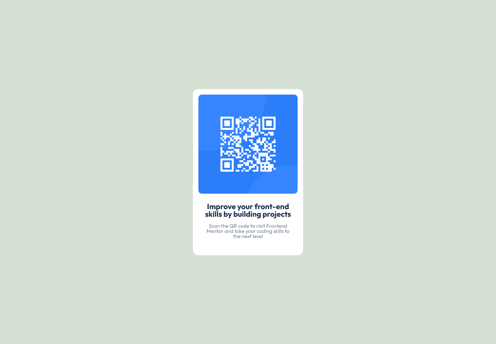

# Frontend Mentor - QR code component solution

This is a solution to the [QR code component challenge on Frontend Mentor](https://www.frontendmentor.io/challenges/qr-code-component-iux_sIO_H). Frontend Mentor challenges help you improve your coding skills by building realistic projects. 

## Table of contents

- [Overview](#overview)
  - [Screenshot](#screenshot)
  - [Links](#links)
- [My process](#my-process)
  - [Built with](#built-with)
  - [What I learned](#what-i-learned)
  - [Continued development](#continued-development)
  - [Useful resources](#useful-resources)
- [Author](#author)
- [Acknowledgments](#acknowledgments)

## Overview

### Screenshot



### Links

- Solution URL: [Frontend Mentor](https://www.frontendmentor.io/solutions/responsive-qr-code-using-css-flexbox-1b7B25z1M7)
- Live Site URL: [Vercel](https://qr-code-drab-seven.vercel.app)

## My process

### Built with

- Semantic HTML5 markup
- CSS custom properties
- Flexbox
- Mobile-first workflow

### What I learned

I learned the importance of adding an alt attribute to images, as it improves accessibility by allowing screen readers to describe images to visually impaired users.

```html

```

### Continued development

I want to continue learning about using rem and % units to create responsive elements. Understanding how to effectively implement these units will help improve the adaptability of my designs across different screen sizes.

### Useful resources

- [A guide to flexbox](https://css-tricks.com/snippets/css/a-guide-to-flexbox/) - This resource helped me keep track of which flex properties to use effectively.

## Author

- Frontend Mentor - [@GMarqz](https://www.frontendmentor.io/profile/GMarqz)
- Linkedin - [Gabriel Marques](https://www.linkedin.com/in/gabriel-marques-1688352aa/)
